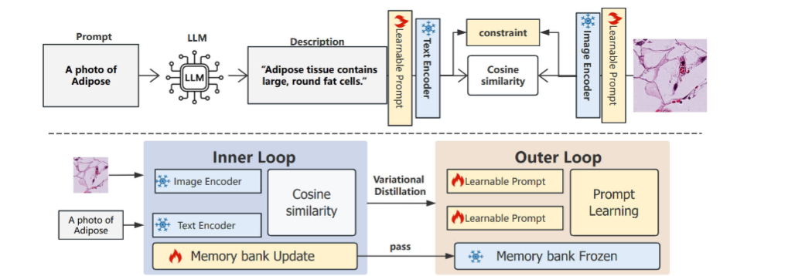

# PromptDVD
Fine-grained Alignment in Medical Pathology Vision-Language Models via Variational Distillation
病理图像分类的 **PromptDVD** 核心代码。

**PromptDVD 原名 VcdPrompt**，写作阶段更名为 PromptDVD（DVD）。二者指同一方法；仓库中 trainer 类名仍为 `VcdPrompt`，这是历史实现名，不是另一套算法。

本仓库从实验工程抽出可独立运行的训练代码，不包含权重、数据集、中间结果，以及 ATPrompt / DPC / TextRefiner 等对比方法。

## 方法概览

PromptDVD 在多模态 prompt 上引入 LLM 类别描述、视觉–文本约束，以及 Inner / Outer 双环的 variational distillation 与 memory bank：



- `trainers/vcdprompt.py`：完整 PromptDVD 模型（含 IB）
- `trainers/vcdprompt_lambda.py`：`VcdPromptLambda`，可单独调节 distill / VSD 权重
- `trainers/vcdprompt_no_ib.py`：`VcdPromptNoIB`，将 IB 替换为 Identity

训练时请使用 `--trainer VcdPrompt`（即 PromptDVD 完整模型）。

## 目录结构

```text
PromptDVD/
├── train.py                      # 训练 / 评估入口
├── trainers/                     # PromptDVD 核心实现（类名仍为 VcdPrompt）
├── datasets/                     # 数据集读取（不含图像本身）
├── configs/
│   ├── datasets/                 # 数据集配置
│   └── trainers/VcdPrompt/       # 方法超参
├── clip/                         # 修改后的 CLIP（MaPLe-style prompt）
├── gpt_file/                     # 类别描述 prompt
├── Dassl.pytorch/                # Dassl 训练框架
├── pretrained/plip/              # 放置 PLIP 权重
├── assets/framework.png          # 方法示意图
├── run_fewshot.py
├── run_generalization.py
└── run_cross_organ.py
```

## 环境

建议 Python 3.8+，已安装 PyTorch（含 CUDA）。

```bash
git clone https://github.com/RlinH/PromptDVD.git
cd PromptDVD
pip install -r requirements.txt
pip install -e Dassl.pytorch
```

将 PLIP ViT-B/32 权重放到：

```text
pretrained/plip/plip_vit_b32.pt
```

代码会用 `torch.load` 读取该 `state_dict`。可参考 [PLIP](https://huggingface.co/vinid/plip) 自行转换后放入上述路径。

## 数据

`--root` 指向医学数据集根目录（本机实验默认 `D:\MLDL\PromptDVD\MedDataset`）。各数据集内部路径形如 `../MedDataset/Kather/`，与 `--root` 拼接后应能定位到：

```text
<MedDataset>/
├── Kather/
├── colorectal/
├── bloodmnist/
├── KIMIA/
└── pannuke_cross/
    ├── adrenal_gland/
    └── ...
```

也可用环境变量：

```bash
set MED_DATASET_ROOT=D:\MLDL\PromptDVD\MedDataset
```

## 训练

在仓库根目录执行。`--trainer VcdPrompt` 即完整 PromptDVD。

### 单次训练（Kather few-shot）

```bash
python train.py ^
  --root D:\MLDL\PromptDVD\MedDataset ^
  --seed 1 ^
  --trainer VcdPrompt ^
  --dataset-config-file configs/datasets/kather.yaml ^
  --config-file configs/trainers/VcdPrompt/vcdprompt-Kather-fs.yaml ^
  --output-dir output/fewshot/Kather/PromptDVD ^
  DATASET.NUM_SHOTS 5 DATASET.SUBSAMPLE_CLASSES all
```

### Few-shot

```bash
python run_fewshot.py --root D:\MLDL\PromptDVD\MedDataset
```

### Base-to-New 泛化

```bash
python run_generalization.py --root D:\MLDL\PromptDVD\MedDataset
```

### Cross-organ（PanNuke）

```bash
python run_cross_organ.py --root D:\MLDL\PromptDVD\MedDataset
```

### 消融

无 IB：

```bash
python train.py --trainer VcdPromptNoIB ...
```

关闭蒸馏与 VSD（`distill_w=0, vsd_w=0`）：

```bash
python train.py --trainer VcdPromptLambda ... TRAINER.VCD_LAMBDA.DISTILL_W 0.0 TRAINER.VCD_LAMBDA.VSD_W 0.0
```

## 致谢

训练框架基于 [Dassl.pytorch](https://github.com/KaiyangZhou/Dassl.pytorch)；视觉-语言模型基于 [CLIP](https://github.com/openai/CLIP) 与病理预训练 [PLIP](https://github.com/PathologyFoundation/plip)。多模态 prompt 结构参考 MaPLe / CoPrompt。
